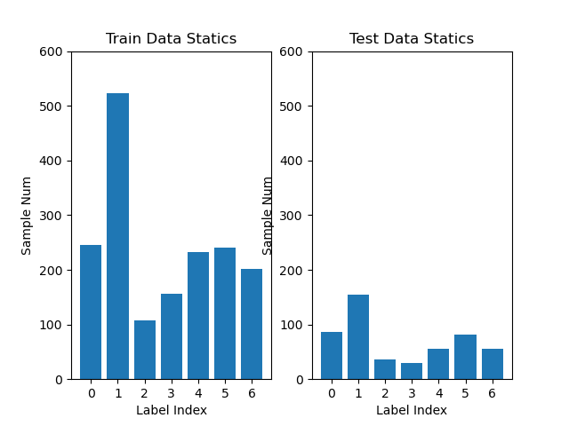

# GNN调研

## 目录：

[TOC]

## 任务：

弄清GNN的输入格式、关系型、CSV、JSON等，用Demo说明

## GNN概述及应用

### awosome information resource：

- 清华大学NLP组：GNN介绍及必读文章https://github.com/thunlp/GNNPapers
- 知乎：GNN阅读合集https://zhuanlan.zhihu.com/c_1139920494823342080


### 《Graph Neural Networks: A Review of Methods and Applications》

#### GNN简介

> Graph neural networks (GNNs) are connectionist models that capture the dependence of graphs via message passing between the nodes of graphs

GNN是一种连接模型，通过学习图节点之间的连接关系来捕获图的依赖特征。

> Recently, researches of analyzing graphs with machine learning have been receiving more and more attention because of the great expressive power of graphs.

最近，由于图具有优秀的表达能力，因此在机器学习中对图的研究获得了越来越多的关注。

> As a unique non-Euclidean data structure for machine learning, graph analysis focuses on node classification, link prediction, and clustering.

图作为机器学习中一种独特的非欧几里得数据结构，对图的分析主要专注于节点分类、关系预测、聚类等方面。

#### GNN起源

GNN的起源：CNN和图嵌入（graph embedding）

> As we are going deeper into CNNs and graphs, we found the keys of CNNs: local connection, shared weights and the use of multi-layer.

CNN的核心特点：局部连接、权重共享、多层叠加。（这些在图中也可以使用，因为图是最经典的局部连接结构，但图属于非欧几里得数据，CNN的卷积和池化操作很难迁移到图中，因此诞生了GNN）


> The other motivation comes from graph embedding [11]– [15], which learns to represent graph nodes, edges or subgraphs in low-dimensional vectors.

所谓嵌入，就是对图的节点、边、或者子图学习得到一个低维的向量表示。

基于表征学习的图嵌入方法缺陷：

1. 节点编码中权重未共享，导致权重参数随着节点增多而线性增大
2. 直接嵌入方法缺乏泛化能力，无法处理动态图以及泛化到新的图

#### GNN和传统神经网络的区别

由于传统的神经网络都需要节点之间按照标准的顺序排列，因此传统神经网络CNN、RNN都不能适当地处理图结构输入。

> GNNs propagate on each node respectively, ignoring the input order of nodes. In other words, the output of GNNs is invariant for the input order of nodes.

GNN采用在每个节点上分别传播（propagate）的方式进行学习，由此忽略了节点的顺序。即GNN的输出会随着输入的不同而不同。

> Generally, GNNs update the hidden state of nodes by a weighted sum of the states of their neighborhood.

通常，GNN通过对其相邻节点的加权求和来更新节点的隐藏状态。

#### GNN分类

- 图卷积网络（Graph Convolutional Networks, GCN）和图注意力网络（Graph Attention Networks, GAN）。因为两者都涉及到传播步骤（propagation step）
- 图空域网络（Graph spatial-temporal networks）。因为该模型常用在动态图上。
- 图自编码器（Graph AutoEncoder），因为该模型通常使用无监督学习方式（unsupervised）
- 图生成网络（Graph Generative Networks）,因为是生成式网络。

## GNN实战

### PyG框架安装

#### Pytorch安装

使用anaconda+cuda10.2环境

https://pytorch.org/get-started/locally/ 在网站中选择配置参数，获取安装命令


```shell
conda install pytorch torchvision cudatoolkit=10.2 -c pytorch
```

最新版本为pytorch=1.5.1

#### PyG模块安装

（需科学上网，不然可能因为下载包不全而报错）

```shell
pip install torch-scatter==latest+cu102 -f https://pytorch-geometric.com/whl/torch-1.5.0.html
pip install torch-sparse==latest+cu102 -f https://pytorch-geometric.com/whl/torch-1.5.0.html
pip install torch-cluster==latest+cu102 -f https://pytorch-geometric.com/whl/torch-1.5.0.html
pip install torch-spline-conv==latest+cu102 -f https://pytorch-geometric.com/whl/torch-1.5.0.html
pip install torch-geometric
```

### PyG框架测试

PyG项目GitHub地址：https://github.com/rusty1s/pytorch_geometric

测试用例：

```shell
$ cd examples
$ python gcn.py
```

测试结果：

```shell
(gnn) F:\OneDrive\研一\GNN\pytorch_geometric-master>cd examples

(gnn) F:\OneDrive\研一\GNN\pytorch_geometric-master\examples>python gcn.py
Downloading https://github.com/kimiyoung/planetoid/raw/master/data/ind.cora.x
Downloading https://github.com/kimiyoung/planetoid/raw/master/data/ind.cora.tx
Downloading https://github.com/kimiyoung/planetoid/raw/master/data/ind.cora.allx
Downloading https://github.com/kimiyoung/planetoid/raw/master/data/ind.cora.y
Downloading https://github.com/kimiyoung/planetoid/raw/master/data/ind.cora.ty
Downloading https://github.com/kimiyoung/planetoid/raw/master/data/ind.cora.ally
Downloading https://github.com/kimiyoung/planetoid/raw/master/data/ind.cora.graph
Downloading https://github.com/kimiyoung/planetoid/raw/master/data/ind.cora.test.index
Processing...
Done!
Epoch: 001, Train: 0.2786, Val: 0.2400, Test: 0.2490
Epoch: 002, Train: 0.5857, Val: 0.3280, Test: 0.3390
Epoch: 003, Train: 0.6571, Val: 0.3640, Test: 0.3680
......
Epoch: 197, Train: 0.9929, Val: 0.8000, Test: 0.8210
Epoch: 198, Train: 0.9929, Val: 0.8000, Test: 0.8210
Epoch: 199, Train: 0.9929, Val: 0.8000, Test: 0.8210
Epoch: 200, Train: 0.9929, Val: 0.8000, Test: 0.8210

(gnn) F:\OneDrive\研一\GNN\pytorch_geometric-master\examples>
```

### PyG输入数据格式

PyG官方文档：https://pytorch-geometric.readthedocs.io/en/latest/notes/introduction.html

在PyG中，图（graph）被用来构建节点（nodes）之间的关系（relations）。每个graph都被定义为`torch_geometric.data.Data`，默认具有以下属性**（非必须）**：

- `data.x`：节点特征矩阵，shape为`[num_nodes, num_node_features]`

- `data.edge_index`：COO格式的图连接（Graph connectivity）数据，shape为`[2, num_edges]`，type为`torch.long`

- `data.edge_attr`：边特征矩阵，shape为`[num_edges, num_edges_features]`

- `data.y`：训练目标（Target to train against），shape不固定。例如：对于node-level的任务，shape为`[num_nodes, *]`，对于graph-level的任务，shape为`[1, *]`。

  > Applications to a graphical domain can generally be divided into two broad classes, called **graph-focused** and **node-focused**. ——《The Graph Neural Network Model》

- `data.pos`：节点的位置矩阵（position matrix），shape为`[num_nodes, num_dimensions]`

实例：


如图为一个不带权重的无向图，有三个顶点0、1、2，以及两条无向边，每个顶点的特征维度为1即$X_1$

```python
import torch
from torch_geometric.data import Data
edge_index = torch.tensor([0, 1, 1, 2],
                          [1, 0, 2, 1], dtype=torch.long)
x = torch.tensor([-1, 0, 1], dtype=torch.float)
data = Data(x = x, edge_index = edge_index)
```

### Cora数据集介绍

Cora数据集（引文网络）是由众多机器学习领域的论文组成，是近年来图深度学习领域最常用的数据集之一，这些论文总共被分为7个类别：

- 基于案例Case based
- 生成算法Genetic Algorithms
- 神经网络Neural Networks
- 概率方法Probabilistic Methods
- 强化学习Reinforcement Leraning
- 规则学习Rule Learning
- 理论Theory

在该数据集中，每一篇论文至少引用了该数据集中的其他论文或者被其他论文所引用，总共有2708篇papers。每篇论文有1433个`word_attributes`，即每个节点的特征维度是1433.

数据集文件夹共包含两个文件：

1. `.content`：包含对每一个paper的描述，格式为：

   `<paper_id> + <word_attributes> + <class_label>`

   - `paper_id`：paper的唯一标识符
   - `word_attributes`：词汇特征，取值为0或1，表示对应词汇是否存在
   - `class_label`：论文的类别

   数据样例：

   ```shell
   31336	0	0	0	0	0	0	0	0  ...	0	0	0	0	0	0	Neural_Networks
   1061127	0	0	0	0	0	0	0	0  ...	0	0	0	1	0	0	Rule_Learning
   ```

2. `.cite`：包含数据集的引用图（citation graph），格式为：

   `<ID of cited paper> + <ID of citing paper>`

   例如有一行为`paper1 paper2`，表示`paper2`引用了`paper1`。

   数据样例：

   ```shell
   35	1033
   35	103482
   35	103515
   35	1050679
   ```

### Cora数据预处理

需要从cora原始文件中提取出相关数据信息，并转换为GNN能够识别的格式。

GNN的输入数据简单来讲需要以下数据：

- 节点node
- 节点特征矩阵node feature matrix
- 边edge
- 边的特征矩阵edge feature matrix（非必须）
- 训练目标y

对于Cora数据集来说，可以从`.content`文件中提取节点的相关数据，包括节点，节点特征矩阵，训练目标；可以从`.cite`文件中提取边的数据，本例无边的特征矩阵数据。

```python
import numpy as np
import torch
import matplotlib.pyplot as plt
from torch_geometric.data import Data


content_path = './cora/cora.content'
cite_path = './cora/cora.cites'

with open(content_path, "r") as f:
    contents = f.readlines()
with open(cite_path, "r") as f:
    cites = f.readlines()

# contents, cites are lists
# print(np.array(contents).shape) # (2708,)
# print(np.array(cites).shape) # (5429,)
# print(contents[0]) # \t划分数据

# contents数据切分 -> <paper> + <feature> + <label>
contents = np.array([np.array(line.strip().split("\t")) for line in contents])
# print(contents.shape) # (2708, 1435)
paper_list, feature_list, label_list = np.split(contents, [1, -1], axis=1)
paper_list, label_list = np.squeeze(paper_list), np.squeeze(label_list)

# paper -> dict
paper_dict = dict([(key, val) for val, key in enumerate(paper_list)])
# print(paper_dict[31336]) # '31336': 0

# label -> dict
labels = list(set(label_list))
label_dict = dict([(key, val) for val, key in enumerate(labels)])
# print(label_dict['Rule_learning']) # 'Rule_Learning': 0

# cites数据整理
cites = [line.strip().split("\t") for line in cites]
# 将cites中引用关系的paperID转换为paper_dict字典序，最后转置矩阵是为了满足PyG输入中edge_index的要求
# cite_id[0]为被引用文献的paper_id, cite_id[1]为引用文献的paper_id
cites = np.array([[paper_dict[cite_id[0]], paper_dict[cite_id[1]]] for cite_id in cites], np.int64).T
# cites.shape = (2, 5429)
cites = np.concatenate((cites, cites[::-1, :]), axis=1)
# cites.shape = (2, 5429*2)

# y构建
y = np.array([label_dict[i] for i in label_list])

# Input
node_num = len(paper_list)         # 节点个数
feat_dim = feature_list.shape[1]   # 特征维度
stat_dim = 32                      # 状态维度
num_class = len(labels)            # 节点种类数

x = torch.from_numpy(np.array(feature_list, dtype=np.float32))
edge_index = torch.from_numpy(cites)
y = torch.from_numpy(y)
data = Data(x = x, edge_index = edge_index, y = y)

# 分割数据集
data.train_mask = torch.zeros(data.num_nodes, dtype=torch.uint8)
data.train_mask[:data.num_nodes - 1000] = 1  #1708 train
data.val_mask = None                        #0 valid
data.test_mask = torch.zeros(data.num_nodes, dtype=torch.uint8)
data.test_mask[data.num_nodes - 500:] = 1  #500 test
data.num_classes = len(label_dict)

# 输出图信息
print("{}Data Info{}".format("*"*20, "*"*20))
print("==> Is undirected graph : {}".format(data.is_undirected()))
print("==> Number of edges : {}/2={}".format(data.num_edges, int(data.num_edges/2)))
print("==> Number of nodes : {}".format(data.num_nodes))
print("==> Node feature dim : {}".format(data.num_node_features))
print("==> Number of training nodes : {}".format(data.train_mask.sum().item()))
print("==> Number of testing nodes : {}".format(data.test_mask.sum().item()))
print("==> Number of classes : {}".format(data.num_classes))
```

最终得到的Graph信息如下：

```shell
********************Data Info********************
==> Is undirected graph : True
==> Number of edges : 10858/2=5429
==> Number of nodes : 2708
==> Node feature dim : 1433
==> Number of training nodes : 1708
==> Number of testing nodes : 500
==> Number of classes : 7
```

### 使用自处理的Cora数据集进行GCN的训练和节点分类

训练和分类代码来自于PyG的官方实例gcn.py，对Cora数据集的预处理替换为上文中的方法。

```python
import os.path as osp
import argparse

import numpy as np
import torch
import torch.nn.functional as F
from torch_geometric.data import Data
from torch_geometric.datasets import Planetoid
import torch_geometric.transforms as T
from torch_geometric.nn import GCNConv, ChebConv

import matplotlib.pyplot as plt

parser = argparse.ArgumentParser()
parser.add_argument('--use_gdc', action='store_true',
                    help='Use GDC preprocessing.')
args = parser.parse_args()

# dataset = 'Cora'
# path = osp.join(osp.dirname(osp.realpath(__file__)), '..', 'data', dataset)
# dataset = Planetoid(path, dataset, transform=T.NormalizeFeatures())
# data = dataset[0]

# add my dataset process code
def dataset_process():
    content_path = './cora/cora.content'
    cite_path = './cora/cora.cites'

    with open(content_path, "r") as f:
        contents = f.readlines()
    with open(cite_path, "r") as f:
        cites = f.readlines()

    # contents数据切分 -> <paper> + <feature> + <label>
    contents = np.array([np.array(line.strip().split("\t")) for line in contents])
    # print(contents.shape) # (2708, 1435)
    paper_list, feature_list, label_list = np.split(contents, [1, -1], axis=1)
    paper_list, label_list = np.squeeze(paper_list), np.squeeze(label_list)

    # paper -> dict
    paper_dict = dict([(key, val) for val, key in enumerate(paper_list)])
    # print(paper_dict[31336]) # '31336': 0

    # label -> dict
    labels = list(set(label_list))
    label_dict = dict([(key, val) for val, key in enumerate(labels)])
    # print(label_dict['Rule_learning']) # 'Rule_Learning': 0

    # cites数据整理
    cites = [line.strip().split("\t") for line in cites]
    # 将cites中引用关系的paperID转换为paper_dict字典序，最后转置矩阵是为了满足PyG输入中edge_index的要求
    # cite_id[0]为被引用文献的paper_id, cite_id[1]为引用文献的paper_id
    cites = np.array([[paper_dict[cite_id[0]], paper_dict[cite_id[1]]] for cite_id in cites], np.int64).T
    # cites.shape = (2, 5429)
    cites = np.concatenate((cites, cites[::-1, :]), axis=1)
    # cites.shape = (2, 5429*2)

    # y构建
    y = np.array([label_dict[i] for i in label_list])

    x = torch.from_numpy(np.array(feature_list, dtype=np.float32))
    edge_index = torch.from_numpy(cites)
    y = torch.from_numpy(y)
    data = Data(x=x, edge_index=edge_index, y=y)

    # 分割数据集
    data.train_mask = torch.zeros(data.num_nodes, dtype=torch.bool)
    data.train_mask[:data.num_nodes - 1000] = 1  # 1708 train
    data.val_mask = None  # 0 valid
    data.test_mask = torch.zeros(data.num_nodes, dtype=torch.bool)
    data.test_mask[data.num_nodes - 500:] = 1  # 500 test
    data.num_classes = len(label_dict)

    # 输出数据集的有关数据
    print("{}Data Info{}".format("*" * 20, "*" * 20))
    print("==> Is undirected graph : {}".format(data.is_undirected()))
    print("==> Number of edges : {}/2={}".format(data.num_edges, int(data.num_edges / 2)))
    print("==> Number of nodes : {}".format(data.num_nodes))
    print("==> Node feature dim : {}".format(data.num_features))
    print("==> Number of training nodes : {}".format(data.train_mask.sum().item()))
    print("==> Number of testing nodes : {}".format(data.test_mask.sum().item()))
    print("==> Number of classes : {}".format(data.num_classes))

    # 输出数据集各类别的条形统计图
    print(f"{'-'*30} Label Info {'-'*30}")
    print(("\n{}"*7).format(*[(i,j) for j,i in label_dict.items()]))
    inds, nums = np.unique(y[data.train_mask].numpy(), return_counts=True)
    plt.figure(1)
    plt.subplot(121)
    plt.bar(x=inds, height=nums, width=0.8, bottom=0, align='center')
    plt.xticks(ticks=range(data.num_classes))
    plt.xlabel(xlabel="Label Index")
    plt.ylabel(ylabel="Sample Num")
    plt.ylim((0, 600))
    plt.title(label="Train Data Statics")
    inds, nums = np.unique(y[data.test_mask].numpy(), return_counts=True)
    plt.subplot(122)
    plt.bar(x=inds, height=nums, width=0.8, bottom=0, align='center')
    plt.xticks(ticks=range(data.num_classes))
    plt.xlabel(xlabel="Label Index")
    plt.ylabel(ylabel="Sample Num")
    plt.ylim((0, 600))
    plt.title(label="Test Data Statics")
    plt.savefig("dataset_info.png")

    return data


# my dataset process function
data = dataset_process()

if args.use_gdc:
    gdc = T.GDC(self_loop_weight=1, normalization_in='sym',
                normalization_out='col',
                diffusion_kwargs=dict(method='ppr', alpha=0.05),
                sparsification_kwargs=dict(method='topk', k=128,
                                           dim=0), exact=True)
    data = gdc(data)


class Net(torch.nn.Module):
    def __init__(self):
        super(Net, self).__init__()
        self.conv1 = GCNConv(data.num_features, 16, cached=True,
                             normalize=not args.use_gdc)
        self.conv2 = GCNConv(16, data.num_classes, cached=True,
                             normalize=not args.use_gdc)
        # self.conv1 = ChebConv(data.num_features, 16, K=2)
        # self.conv2 = ChebConv(16, data.num_features, K=2)

        self.reg_params = self.conv1.parameters()
        self.non_reg_params = self.conv2.parameters()

    def forward(self):
        x, edge_index = data.x, data.edge_index
        x = F.relu(self.conv1(x, edge_index))
        x = F.dropout(x, training=self.training)
        x = self.conv2(x, edge_index)
        return F.log_softmax(x, dim=1)


device = torch.device('cuda' if torch.cuda.is_available() else 'cpu')
model, data = Net().to(device), data.to(device)
optimizer = torch.optim.Adam([
    dict(params=model.reg_params, weight_decay=5e-4),
    dict(params=model.non_reg_params, weight_decay=0)
], lr=0.01)


def train():
    model.train()
    optimizer.zero_grad()
    F.nll_loss(model()[data.train_mask], data.y[data.train_mask].long()).backward()
    optimizer.step()


@torch.no_grad()
def test():
    model.eval()
    logits, accs = model(), []
    for _, mask in data('train_mask', 'test_mask'):
        pred = logits[mask].max(1)[1]
        acc = pred.eq(data.y[mask]).sum().item() / mask.sum().item()
        accs.append(acc)
    return accs


best_val_acc = test_acc = 0
for epoch in range(1, 21):
    train()
    train_acc, test_acc = test()
    log = 'Epoch: {:03d}, Train: {:.4f}, Test: {:.4f}'
    print(log.format(epoch, train_acc, test_acc))
```

为了缩短计算时常并便于显示，训练轮次设定为20，此外还生成了训练集和测试集中各类别节点的数量情况：



训练结果如下：

```shell
(gnn) F:\OneDrive\研一\GNN\GNN-KG-Review>python gcn_demo.py
********************Data Info********************
==> Is undirected graph : True
==> Number of edges : 10858/2=5429
==> Number of nodes : 2708
==> Node feature dim : 1433
==> Number of training nodes : 1708
==> Number of testing nodes : 500
==> Number of classes : 7
------------------------------ Label Info ------------------------------

(0, 'Probabilistic_Methods')
(1, 'Neural_Networks')
(2, 'Rule_Learning')
(3, 'Reinforcement_Learning')
(4, 'Theory')
(5, 'Genetic_Algorithms')
(6, 'Case_Based')
Epoch: 001, Train: 0.4139, Test: 0.3660
Epoch: 002, Train: 0.4256, Test: 0.3700
Epoch: 003, Train: 0.4690, Test: 0.4020
Epoch: 004, Train: 0.5498, Test: 0.4700
Epoch: 005, Train: 0.6399, Test: 0.5440
Epoch: 006, Train: 0.6996, Test: 0.5840
Epoch: 007, Train: 0.7248, Test: 0.6260
Epoch: 008, Train: 0.7424, Test: 0.6600
Epoch: 009, Train: 0.7547, Test: 0.6660
Epoch: 010, Train: 0.7646, Test: 0.6880
Epoch: 011, Train: 0.7728, Test: 0.7000
Epoch: 012, Train: 0.7863, Test: 0.7160
Epoch: 013, Train: 0.7974, Test: 0.7280
Epoch: 014, Train: 0.8185, Test: 0.7340
Epoch: 015, Train: 0.8320, Test: 0.7420
Epoch: 016, Train: 0.8460, Test: 0.7580
Epoch: 017, Train: 0.8612, Test: 0.7820
Epoch: 018, Train: 0.8712, Test: 0.7860
Epoch: 019, Train: 0.8852, Test: 0.7960
Epoch: 020, Train: 0.8964, Test: 0.8020

(gnn) F:\OneDrive\研一\GNN\GNN-KG-Review>
```


## Pytorch学习

见pytorch文件夹中的[README](./pytorch/README.md)文档

## Graph图存储

### neo4j介绍

Neo4j是最常见的图数据库，其他还有JanusGraph，HuguGraph，TigerGraph，Gstore很多种类。其中Neo4j是最常用，也是完成度最高，上手最快的一款图数据库应用。目前大部分知识图谱均使用Neo4j作为图存储工具，因此其社区教程和QA相比其他图数据库更加完善。

### Cora2neo

在Neo4j中，采用先添加节点Node，然后添加节点之间的关系Relationship。在Python下对Neo4j读写采用的是py2neo库。

#### 添加节点

从`cora.content`中得到`paper_list`和`feature_list`之后，通过创建Node类，然后调用create方法添加节点

```python
graph.delete_all() # 清空图数据库
for i in range(paper_list.shape[0]):
    feature = dict([(str(val), key) for val, key in enumerate(feature_list[i])])
    a = Node('Paper', name=str(paper_list[i][0]), **feature)
    graph.create(a)
```

但通过测试发现，这种方法在进行大量节点的添加时，速度很慢（本文添加2708个带有1435个属性的节点使用了近两分钟）。在查阅官方文档和一些资料后，发现可以使用事务的方式，统一创建子图，然后再添加到图数据库中（待完成）

#### 添加关系

从`cora.cite`中得到论文引用关系`cite`之后，通过查询指定名称的节点，然后为其创建相应的引用关系，最后调用create方法添加关系

```python
for cite_list in cites:
    paper1, paper2 = cite_list[0], cite_list[1]
    a = matcher.match("Paper").where(f"_.name='{paper1}'").first()
    b = matcher.match("Paper").where(f"_.name='{paper2}'").first()
    rel = Relationship(b, "CITE", a)
    graph.create(rel)
```

测试发现，因为需要先查询两次节点的原因，关系的添加很慢，15分钟只添加了2000条左右的关系，需要优化。

#### 存储优化

在`cora.cite`中，是按照被引文献进行排序的，即引用同一篇文献的引用关系放在一起，例如文件的前十行均为paperID为35的文章

```shell
['35', '1033']
['35', '103482']
['35', '103515']
['35', '1050679']
['35', '1103960']
['35', '1103985']
['35', '1109199']
['35', '1112911']
['35', '1113438']
['35', '1113831']
```

因此可以在创建节点时，直接创建关系，然后一起添加到图数据库中。

整体思路是：按照引用关系`[paper1, paper2]`进行遍历，首先判断paper1是否改变，若不变则省去一次创建节点的次数；然后判断paper2是否已经在数据库中，若不在则创建，若在则查询；最后根据两个节点建立相应的关系。

优化效果很好，存储用时从原来的1小时以上降低到10分钟左右。

后续可以使用事务和子图机制进一步缩短存储时间。

```python
import numpy as np
from py2neo import Graph, Node, Relationship, NodeMatcher

graph = Graph("http://localhost//:7474", username="neo4j", password="123456")
matcher = NodeMatcher(graph)

content_path = './cora/cora.content'
cite_path = './cora/cora.cites'

with open(content_path, "r") as f:
    contents = f.readlines()
with open(cite_path, "r") as f:
    cites = f.readlines()

contents = np.array([line.strip().split('\t') for line in contents])
paper_list, feature_list, label_list = np.split(contents, [1, -1], axis=1)
feature_list = np.concatenate((feature_list, label_list), axis=1)
paper_list = np.squeeze(paper_list)
cites = [line.strip().split("\t") for line in cites]  # 5429

node_dict = dict([(key, 0) for val, key in enumerate(paper_list)])  # 校验paper是否已添加入数据库
paper_dict = dict([(key, val) for val, key in enumerate(paper_list)])  # 生成PaperID到矩阵行数的映射

citedID = '0'
a_node = Node()
b_node = Node()
graph.delete_all()  # 清空图数据库
index = 0

for cite_list in cites:
    paper1, paper2 = cite_list[0], cite_list[1]
    # 先后创建或查询a_node和b_node
    if paper1 != citedID:  # a_node发生改变，需要查找或创建
        if node_dict[paper1] == 0:  #a_node不在数据库中，需要创建
            feature = dict([(str(val), key) for val, key in enumerate(feature_list[paper_dict[paper1]])])
            a_node = Node("Paper", name=paper1, **feature)
            graph.create(a_node)
            node_dict[paper1] = 1
        else:  # a_node在数据库中，需要查找
            a_node = matcher.match("Paper").where(f"_.name='{paper1}'").first()
        citedID = paper1
    # a_node已有，只需查找或创建b_node
    if node_dict[paper2] == 0:  # b_node不在数据库中，需要创建
        feature = dict([(str(val), key) for val, key in enumerate(feature_list[paper_dict[paper2]])])
        b_node = Node("Paper", name=paper2, **feature)
        graph.create(b_node)
        node_dict[paper2] = 1
    else:  # b_node在数据库中，需要查找
        b_node = matcher.match("Paper").where(f"_.name='{paper2}'").first()
    # 得到关系的两个对应节点后，创建关系
    rel = Relationship(b_node, "CITE", a_node)  # 创建关系
    graph.create(rel)

    if index%100 == 0:
        print(f"{index} relations have been added")
    index += 1
```

