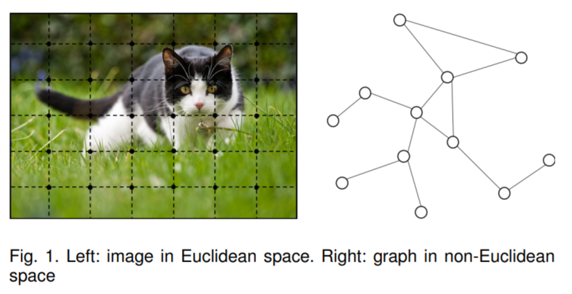
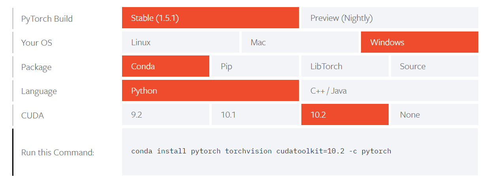
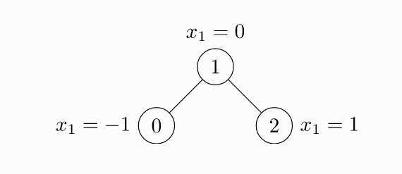

# GNN调研

## 任务：

弄清GNN的输入格式、关系型、CSV、JSON等，用Demo说明

## GNN概述及应用

awosome information resource：

- 清华大学NLP组：GNN介绍及必读文章https://github.com/thunlp/GNNPapers
- 知乎：GNN阅读合集https://zhuanlan.zhihu.com/c_1139920494823342080


### 《Graph Neural Networks: A Review of Methods and Applications》

#### GNN简介

> Graph neural networks (GNNs) are connectionist models that capture the dependence of graphs via message passing between the nodes of graphs

GNN是一种连接模型，通过学习图节点之间的连接关系来捕获图的依赖特征。

> Recently, researches of analyzing graphs with machine learning have been receiving more and more attention because of the great expressive power of graphs.

最近，由于图具有优秀的表达能力，因此在机器学习中对图的研究获得了越来越多的关注。

> As a unique non-Euclidean data structure for machine learning, graph analysis focuses on node classification, link prediction, and clustering.

图作为机器学习中一种独特的非欧几里得数据结构，对图的分析主要专注于节点分类、关系预测、聚类等方面。

#### GNN起源

GNN的起源：CNN和图嵌入（graph embedding）

> As we are going deeper into CNNs and graphs, we found the keys of CNNs: local connection, shared weights and the use of multi-layer.

CNN的核心特点：局部连接、权重共享、多层叠加。（这些在图中也可以使用，因为图是最经典的局部连接结构，但图属于非欧几里得数据，CNN的卷积和池化操作很难迁移到图中，因此诞生了GNN）



> The other motivation comes from graph embedding [11]– [15], which learns to represent graph nodes, edges or subgraphs in low-dimensional vectors.

所谓嵌入，就是对图的节点、边、或者子图学习得到一个低维的向量表示。

基于表征学习的图嵌入方法缺陷：

1. 节点编码中权重未共享，导致权重参数随着节点增多而线性增大
2. 直接嵌入方法缺乏泛化能力，无法处理动态图以及泛化到新的图

#### GNN和传统神经网络的区别

由于传统的神经网络都需要节点之间按照标准的顺序排列，因此传统神经网络CNN、RNN都不能适当地处理图结构输入。

> GNNs propagate on each node respectively, ignoring the input order of nodes. In other words, the output of GNNs is invariant for the input order of nodes.

GNN采用在每个节点上分别传播（propagate）的方式进行学习，由此忽略了节点的顺序。即GNN的输出会随着输入的不同而不同。

> Generally, GNNs update the hidden state of nodes by a weighted sum of the states of their neighborhood.

通常，GNN通过对其相邻节点的加权求和来更新节点的隐藏状态。

#### GNN分类

- 图卷积网络（Graph Convolutional Networks, GCN）和图注意力网络（Graph Attention Networks, GAN）。因为两者都涉及到传播步骤（propagation step）
- 图空域网络（Graph spatial-temporal networks）。因为该模型常用在动态图上。
- 图自编码器（Graph AutoEncoder），因为该模型通常使用无监督学习方式（unsupervised）
- 图生成网络（Graph Generative Networks）,因为是生成式网络。


## GNN实战

### PyG框架安装

#### Pytorch安装

使用anaconda+cuda10.2环境

https://pytorch.org/get-started/locally/ 在网站中选择配置参数，获取安装命令



```shell
conda install pytorch torchvision cudatoolkit=10.2 -c pytorch
```

最新版本为pytorch=1.5.1

#### PyG模块安装（需科学上网，不然可能因为下载包不全而报错）

```shell
pip install torch-scatter==latest+cu102 -f https://pytorch-geometric.com/whl/torch-1.5.0.html
pip install torch-sparse==latest+cu102 -f https://pytorch-geometric.com/whl/torch-1.5.0.html
pip install torch-cluster==latest+cu102 -f https://pytorch-geometric.com/whl/torch-1.5.0.html
pip install torch-spline-conv==latest+cu102 -f https://pytorch-geometric.com/whl/torch-1.5.0.html
pip install torch-geometric
```

### PyG框架测试

PyG项目GitHub地址：https://github.com/rusty1s/pytorch_geometric

测试用例：

```shell
$ cd examples
$ python gcn.py
```

测试结果：

```shell
(gnn) F:\OneDrive\研一\GNN\pytorch_geometric-master>cd examples

(gnn) F:\OneDrive\研一\GNN\pytorch_geometric-master\examples>python gcn.py
Downloading https://github.com/kimiyoung/planetoid/raw/master/data/ind.cora.x
Downloading https://github.com/kimiyoung/planetoid/raw/master/data/ind.cora.tx
Downloading https://github.com/kimiyoung/planetoid/raw/master/data/ind.cora.allx
Downloading https://github.com/kimiyoung/planetoid/raw/master/data/ind.cora.y
Downloading https://github.com/kimiyoung/planetoid/raw/master/data/ind.cora.ty
Downloading https://github.com/kimiyoung/planetoid/raw/master/data/ind.cora.ally
Downloading https://github.com/kimiyoung/planetoid/raw/master/data/ind.cora.graph
Downloading https://github.com/kimiyoung/planetoid/raw/master/data/ind.cora.test.index
Processing...
Done!
Epoch: 001, Train: 0.2786, Val: 0.2400, Test: 0.2490
Epoch: 002, Train: 0.5857, Val: 0.3280, Test: 0.3390
Epoch: 003, Train: 0.6571, Val: 0.3640, Test: 0.3680
Epoch: 004, Train: 0.6000, Val: 0.3640, Test: 0.3680
Epoch: 005, Train: 0.6286, Val: 0.3640, Test: 0.3680
Epoch: 006, Train: 0.7000, Val: 0.4220, Test: 0.4400
Epoch: 007, Train: 0.7071, Val: 0.4640, Test: 0.4660
Epoch: 008, Train: 0.6929, Val: 0.4740, Test: 0.4580
Epoch: 009, Train: 0.7143, Val: 0.4780, Test: 0.4620
Epoch: 010, Train: 0.7357, Val: 0.4900, Test: 0.4880
Epoch: 011, Train: 0.7429, Val: 0.5120, Test: 0.5160
Epoch: 012, Train: 0.7857, Val: 0.5440, Test: 0.5690
Epoch: 013, Train: 0.8000, Val: 0.5580, Test: 0.6080
Epoch: 014, Train: 0.8357, Val: 0.5840, Test: 0.6350
Epoch: 015, Train: 0.8571, Val: 0.6120, Test: 0.6520
Epoch: 016, Train: 0.8857, Val: 0.6280, Test: 0.6680
Epoch: 017, Train: 0.9000, Val: 0.6500, Test: 0.6810
Epoch: 018, Train: 0.9143, Val: 0.6720, Test: 0.6880
Epoch: 019, Train: 0.9143, Val: 0.6900, Test: 0.7000
Epoch: 020, Train: 0.9143, Val: 0.6940, Test: 0.7040
Epoch: 021, Train: 0.9071, Val: 0.6960, Test: 0.7090
Epoch: 022, Train: 0.9071, Val: 0.6960, Test: 0.7090
Epoch: 023, Train: 0.9071, Val: 0.6960, Test: 0.7090
Epoch: 024, Train: 0.9071, Val: 0.6960, Test: 0.7090
Epoch: 025, Train: 0.9143, Val: 0.6960, Test: 0.7090
Epoch: 026, Train: 0.9214, Val: 0.7040, Test: 0.7100
Epoch: 027, Train: 0.9286, Val: 0.7180, Test: 0.7250
Epoch: 028, Train: 0.9429, Val: 0.7300, Test: 0.7330
Epoch: 029, Train: 0.9500, Val: 0.7340, Test: 0.7510
Epoch: 030, Train: 0.9571, Val: 0.7380, Test: 0.7570
Epoch: 031, Train: 0.9571, Val: 0.7460, Test: 0.7680
Epoch: 032, Train: 0.9571, Val: 0.7520, Test: 0.7740
Epoch: 033, Train: 0.9571, Val: 0.7540, Test: 0.7760
Epoch: 034, Train: 0.9571, Val: 0.7560, Test: 0.7720
Epoch: 035, Train: 0.9571, Val: 0.7560, Test: 0.7720
Epoch: 036, Train: 0.9643, Val: 0.7560, Test: 0.7720
Epoch: 037, Train: 0.9643, Val: 0.7560, Test: 0.7720
Epoch: 038, Train: 0.9643, Val: 0.7560, Test: 0.7720
Epoch: 039, Train: 0.9643, Val: 0.7560, Test: 0.7720
Epoch: 040, Train: 0.9643, Val: 0.7580, Test: 0.7650
Epoch: 041, Train: 0.9643, Val: 0.7620, Test: 0.7710
Epoch: 042, Train: 0.9643, Val: 0.7640, Test: 0.7730
Epoch: 043, Train: 0.9643, Val: 0.7660, Test: 0.7810
Epoch: 044, Train: 0.9571, Val: 0.7660, Test: 0.7810
Epoch: 045, Train: 0.9571, Val: 0.7700, Test: 0.7950
Epoch: 046, Train: 0.9571, Val: 0.7720, Test: 0.7990
Epoch: 047, Train: 0.9643, Val: 0.7760, Test: 0.8000
Epoch: 048, Train: 0.9643, Val: 0.7780, Test: 0.8010
Epoch: 049, Train: 0.9643, Val: 0.7780, Test: 0.8010
Epoch: 050, Train: 0.9643, Val: 0.7820, Test: 0.8030
Epoch: 051, Train: 0.9643, Val: 0.7820, Test: 0.8030
Epoch: 052, Train: 0.9643, Val: 0.7820, Test: 0.8030
Epoch: 053, Train: 0.9643, Val: 0.7820, Test: 0.8030
Epoch: 054, Train: 0.9643, Val: 0.7820, Test: 0.8030
Epoch: 055, Train: 0.9643, Val: 0.7820, Test: 0.8030
Epoch: 056, Train: 0.9643, Val: 0.7820, Test: 0.8030
Epoch: 057, Train: 0.9714, Val: 0.7820, Test: 0.8030
Epoch: 058, Train: 0.9714, Val: 0.7820, Test: 0.8030
Epoch: 059, Train: 0.9714, Val: 0.7820, Test: 0.8030
Epoch: 060, Train: 0.9786, Val: 0.7820, Test: 0.8030
Epoch: 061, Train: 0.9786, Val: 0.7820, Test: 0.8030
Epoch: 062, Train: 0.9786, Val: 0.7820, Test: 0.8030
Epoch: 063, Train: 0.9786, Val: 0.7820, Test: 0.8030
Epoch: 064, Train: 0.9643, Val: 0.7820, Test: 0.8030
Epoch: 065, Train: 0.9643, Val: 0.7820, Test: 0.8030
Epoch: 066, Train: 0.9643, Val: 0.7820, Test: 0.8030
Epoch: 067, Train: 0.9714, Val: 0.7820, Test: 0.8030
Epoch: 068, Train: 0.9714, Val: 0.7820, Test: 0.8030
Epoch: 069, Train: 0.9786, Val: 0.7820, Test: 0.8030
Epoch: 070, Train: 0.9786, Val: 0.7820, Test: 0.8030
Epoch: 071, Train: 0.9786, Val: 0.7820, Test: 0.8030
Epoch: 072, Train: 0.9714, Val: 0.7820, Test: 0.8030
Epoch: 073, Train: 0.9714, Val: 0.7880, Test: 0.8120
Epoch: 074, Train: 0.9714, Val: 0.7880, Test: 0.8120
Epoch: 075, Train: 0.9714, Val: 0.7880, Test: 0.8120
Epoch: 076, Train: 0.9714, Val: 0.7880, Test: 0.8120
Epoch: 077, Train: 0.9714, Val: 0.7880, Test: 0.8120
Epoch: 078, Train: 0.9786, Val: 0.7880, Test: 0.8120
Epoch: 079, Train: 0.9786, Val: 0.7880, Test: 0.8120
Epoch: 080, Train: 0.9786, Val: 0.7900, Test: 0.8160
Epoch: 081, Train: 0.9786, Val: 0.7920, Test: 0.8190
Epoch: 082, Train: 0.9857, Val: 0.7920, Test: 0.8190
Epoch: 083, Train: 0.9857, Val: 0.7920, Test: 0.8190
Epoch: 084, Train: 0.9786, Val: 0.7920, Test: 0.8190
Epoch: 085, Train: 0.9786, Val: 0.7920, Test: 0.8190
Epoch: 086, Train: 0.9786, Val: 0.7920, Test: 0.8190
Epoch: 087, Train: 0.9786, Val: 0.7920, Test: 0.8190
Epoch: 088, Train: 0.9786, Val: 0.7920, Test: 0.8190
Epoch: 089, Train: 0.9786, Val: 0.7920, Test: 0.8190
Epoch: 090, Train: 0.9857, Val: 0.7920, Test: 0.8190
Epoch: 091, Train: 0.9857, Val: 0.7920, Test: 0.8190
Epoch: 092, Train: 0.9857, Val: 0.7920, Test: 0.8190
Epoch: 093, Train: 0.9857, Val: 0.7920, Test: 0.8190
Epoch: 094, Train: 0.9857, Val: 0.7920, Test: 0.8190
Epoch: 095, Train: 0.9857, Val: 0.7920, Test: 0.8190
Epoch: 096, Train: 0.9857, Val: 0.7920, Test: 0.8190
Epoch: 097, Train: 0.9857, Val: 0.7920, Test: 0.8190
Epoch: 098, Train: 0.9857, Val: 0.7920, Test: 0.8190
Epoch: 099, Train: 0.9786, Val: 0.7980, Test: 0.8220
Epoch: 100, Train: 0.9786, Val: 0.7980, Test: 0.8220
Epoch: 101, Train: 0.9786, Val: 0.7980, Test: 0.8220
Epoch: 102, Train: 0.9786, Val: 0.7980, Test: 0.8220
Epoch: 103, Train: 0.9857, Val: 0.7980, Test: 0.8220
Epoch: 104, Train: 0.9857, Val: 0.7980, Test: 0.8220
Epoch: 105, Train: 0.9857, Val: 0.7980, Test: 0.8220
Epoch: 106, Train: 0.9857, Val: 0.7980, Test: 0.8220
Epoch: 107, Train: 0.9857, Val: 0.7980, Test: 0.8220
Epoch: 108, Train: 0.9857, Val: 0.7980, Test: 0.8220
Epoch: 109, Train: 0.9857, Val: 0.7980, Test: 0.8220
Epoch: 110, Train: 0.9857, Val: 0.7980, Test: 0.8220
Epoch: 111, Train: 0.9857, Val: 0.7980, Test: 0.8220
Epoch: 112, Train: 0.9857, Val: 0.7980, Test: 0.8220
Epoch: 113, Train: 0.9786, Val: 0.7980, Test: 0.8220
Epoch: 114, Train: 0.9786, Val: 0.7980, Test: 0.8220
Epoch: 115, Train: 0.9857, Val: 0.7980, Test: 0.8220
Epoch: 116, Train: 0.9857, Val: 0.7980, Test: 0.8220
Epoch: 117, Train: 0.9857, Val: 0.7980, Test: 0.8220
Epoch: 118, Train: 0.9857, Val: 0.7980, Test: 0.8220
Epoch: 119, Train: 0.9857, Val: 0.7980, Test: 0.8220
Epoch: 120, Train: 0.9857, Val: 0.7980, Test: 0.8220
Epoch: 121, Train: 0.9857, Val: 0.7980, Test: 0.8220
Epoch: 122, Train: 0.9857, Val: 0.7980, Test: 0.8220
Epoch: 123, Train: 0.9857, Val: 0.7980, Test: 0.8220
Epoch: 124, Train: 0.9857, Val: 0.7980, Test: 0.8220
Epoch: 125, Train: 0.9857, Val: 0.7980, Test: 0.8220
Epoch: 126, Train: 0.9857, Val: 0.7980, Test: 0.8220
Epoch: 127, Train: 0.9857, Val: 0.7980, Test: 0.8220
Epoch: 128, Train: 0.9857, Val: 0.7980, Test: 0.8220
Epoch: 129, Train: 0.9857, Val: 0.7980, Test: 0.8220
Epoch: 130, Train: 0.9857, Val: 0.7980, Test: 0.8220
Epoch: 131, Train: 0.9857, Val: 0.7980, Test: 0.8220
Epoch: 132, Train: 0.9857, Val: 0.7980, Test: 0.8220
Epoch: 133, Train: 0.9857, Val: 0.7980, Test: 0.8220
Epoch: 134, Train: 0.9857, Val: 0.7980, Test: 0.8220
Epoch: 135, Train: 0.9857, Val: 0.7980, Test: 0.8220
Epoch: 136, Train: 0.9857, Val: 0.7980, Test: 0.8220
Epoch: 137, Train: 0.9929, Val: 0.7980, Test: 0.8220
Epoch: 138, Train: 0.9929, Val: 0.7980, Test: 0.8220
Epoch: 139, Train: 0.9929, Val: 0.7980, Test: 0.8220
Epoch: 140, Train: 0.9929, Val: 0.7980, Test: 0.8220
Epoch: 141, Train: 0.9929, Val: 0.7980, Test: 0.8220
Epoch: 142, Train: 0.9929, Val: 0.7980, Test: 0.8220
Epoch: 143, Train: 0.9857, Val: 0.7980, Test: 0.8220
Epoch: 144, Train: 0.9857, Val: 0.7980, Test: 0.8220
Epoch: 145, Train: 0.9857, Val: 0.7980, Test: 0.8220
Epoch: 146, Train: 0.9857, Val: 0.7980, Test: 0.8220
Epoch: 147, Train: 0.9929, Val: 0.7980, Test: 0.8220
Epoch: 148, Train: 0.9929, Val: 0.7980, Test: 0.8220
Epoch: 149, Train: 0.9929, Val: 0.7980, Test: 0.8220
Epoch: 150, Train: 0.9929, Val: 0.7980, Test: 0.8220
Epoch: 151, Train: 0.9929, Val: 0.7980, Test: 0.8220
Epoch: 152, Train: 0.9929, Val: 0.7980, Test: 0.8220
Epoch: 153, Train: 0.9929, Val: 0.7980, Test: 0.8220
Epoch: 154, Train: 0.9929, Val: 0.7980, Test: 0.8220
Epoch: 155, Train: 0.9929, Val: 0.7980, Test: 0.8220
Epoch: 156, Train: 0.9857, Val: 0.7980, Test: 0.8220
Epoch: 157, Train: 0.9857, Val: 0.7980, Test: 0.8220
Epoch: 158, Train: 0.9857, Val: 0.7980, Test: 0.8220
Epoch: 159, Train: 0.9857, Val: 0.7980, Test: 0.8220
Epoch: 160, Train: 0.9857, Val: 0.7980, Test: 0.8220
Epoch: 161, Train: 0.9929, Val: 0.7980, Test: 0.8220
Epoch: 162, Train: 0.9929, Val: 0.7980, Test: 0.8220
Epoch: 163, Train: 0.9929, Val: 0.7980, Test: 0.8220
Epoch: 164, Train: 0.9929, Val: 0.7980, Test: 0.8220
Epoch: 165, Train: 0.9929, Val: 0.7980, Test: 0.8220
Epoch: 166, Train: 0.9929, Val: 0.7980, Test: 0.8220
Epoch: 167, Train: 0.9857, Val: 0.7980, Test: 0.8220
Epoch: 168, Train: 0.9857, Val: 0.7980, Test: 0.8220
Epoch: 169, Train: 0.9857, Val: 0.7980, Test: 0.8220
Epoch: 170, Train: 0.9857, Val: 0.7980, Test: 0.8220
Epoch: 171, Train: 0.9929, Val: 0.8000, Test: 0.8210
Epoch: 172, Train: 0.9929, Val: 0.8000, Test: 0.8210
Epoch: 173, Train: 0.9929, Val: 0.8000, Test: 0.8210
Epoch: 174, Train: 0.9929, Val: 0.8000, Test: 0.8210
Epoch: 175, Train: 0.9929, Val: 0.8000, Test: 0.8210
Epoch: 176, Train: 1.0000, Val: 0.8000, Test: 0.8210
Epoch: 177, Train: 1.0000, Val: 0.8000, Test: 0.8210
Epoch: 178, Train: 1.0000, Val: 0.8000, Test: 0.8210
Epoch: 179, Train: 0.9857, Val: 0.8000, Test: 0.8210
Epoch: 180, Train: 0.9857, Val: 0.8000, Test: 0.8210
Epoch: 181, Train: 0.9857, Val: 0.8000, Test: 0.8210
Epoch: 182, Train: 0.9857, Val: 0.8000, Test: 0.8210
Epoch: 183, Train: 0.9929, Val: 0.8000, Test: 0.8210
Epoch: 184, Train: 0.9929, Val: 0.8000, Test: 0.8210
Epoch: 185, Train: 0.9929, Val: 0.8000, Test: 0.8210
Epoch: 186, Train: 0.9929, Val: 0.8000, Test: 0.8210
Epoch: 187, Train: 0.9929, Val: 0.8000, Test: 0.8210
Epoch: 188, Train: 0.9929, Val: 0.8000, Test: 0.8210
Epoch: 189, Train: 1.0000, Val: 0.8000, Test: 0.8210
Epoch: 190, Train: 1.0000, Val: 0.8000, Test: 0.8210
Epoch: 191, Train: 1.0000, Val: 0.8000, Test: 0.8210
Epoch: 192, Train: 1.0000, Val: 0.8000, Test: 0.8210
Epoch: 193, Train: 1.0000, Val: 0.8000, Test: 0.8210
Epoch: 194, Train: 1.0000, Val: 0.8000, Test: 0.8210
Epoch: 195, Train: 0.9929, Val: 0.8000, Test: 0.8210
Epoch: 196, Train: 0.9929, Val: 0.8000, Test: 0.8210
Epoch: 197, Train: 0.9929, Val: 0.8000, Test: 0.8210
Epoch: 198, Train: 0.9929, Val: 0.8000, Test: 0.8210
Epoch: 199, Train: 0.9929, Val: 0.8000, Test: 0.8210
Epoch: 200, Train: 0.9929, Val: 0.8000, Test: 0.8210

(gnn) F:\OneDrive\研一\GNN\pytorch_geometric-master\examples>
```

### PyG输入数据处理

PyG官方文档：https://pytorch-geometric.readthedocs.io/en/latest/notes/introduction.html

在PyG中，图（graph）被用来构建节点（nodes）之间的关系（relations）。每个graph都被定义为`torch_geometric.data.Data`，默认具有以下属性**（非必须）**：

- `data.x`：节点特征矩阵，shape为`[num_nodes, num_node_features]`

- `data.edge_index`：COO格式的图连接（Graph connectivity）数据，shape为`[2, num_edges]`，type为`torch.long`

- `data.edge_attr`：边特征矩阵，shape为`[num_edges, num_edges_features]`

- `data.y`：训练目标（Target to train against），shape不固定。例如：对于node-level的任务，shape为`[num_nodes, *]`，对于graph-level的任务，shape为`[1, *]`。

  > Applications to a graphical domain can generally be divided into two broad classes, called **graph-focused** and **node-focused**. ——《The Graph Neural Network Model》

- `data.pos`：节点的位置矩阵（position matrix），shape为`[num_nodes, num_dimensions]`

实例：



如图为一个不带权重的无向图，有三个顶点0、1、2，以及两条无向边，每个顶点的特征维度为1即$X_1$

```python
import torch
from torch_geometric.data import Data
edge_index = torch.tensor([0, 1, 1, 2],
                          [1, 0, 2, 1], dtype=torch.long)
x = torch.tensor([-1, 0, 1], dtype=torch.float)
data = Data(x = x, edge_index = edge_index)
```

### Cora数据集介绍

Cora数据集（引文网络）是由众多机器学习领域的论文组成，是近年来图深度学习领域最常用的数据集之一，这些论文总共被分为7个类别：

- 基于案例Case based
- 生成算法Genetic Algorithms
- 神经网络Neural Networks
- 概率方法Probabilistic Methods
- 强化学习Reinforcement Leraning
- 规则学习Rule Learning
- 理论Theory

在该数据集中，每一篇论文至少引用了该数据集中的其他论文或者被其他论文所引用，总共有2708篇papers。每篇论文有1433个`word_attributes`，即每个节点的特征维度是1433.

数据集文件夹共包含两个文件：

1. `.content`：包含对每一个paper的描述，格式为：

   `<paper_id> + <word_attributes> + <class_label>`

   - `paper_id`：paper的唯一标识符
   - `word_attributes`：词汇特征，取值为0或1，表示对应词汇是否存在
   - `class_label`：论文的类别

   数据样例：

   ```shell
   31336	0	0	0	0	0	0	0	0  ...	0	0	0	0	0	0	Neural_Networks
   1061127	0	0	0	0	0	0	0	0  ...	0	0	0	1	0	0	Rule_Learning
   ```

2. `.cite`：包含数据集的引用图（citation graph），格式为：

   `<ID of cited paper> + <ID of citing paper>`

   例如有一行为`paper1 paper2`，表示`paper2`引用了`paper1`。

   数据样例：

   ```shell
   35	1033
   35	103482
   35	103515
   35	1050679
   ```

### Core数据预处理

```python
import numpy as np

content_path = './cora/cora.content'
cite_path = './cora/cora.cites'

with open(content_path, "r") as f:
    contents = f.readlines()
with open(cite_path, "r") as f:
    cites = f.readlines()

# contents, cites are lists
# print(np.array(contents).shape) # (2708,)
# print(np.array(cites).shape) # (5429,)
# print(contents[0]) # \t划分数据

# contents数据切分 -> <paper> + <feature> + <label>
contents = np.array([np.array(line.strip().split("\t")) for line in contents])
# print(contents.shape) # (2708, 1435)
paper_list, feature_list, label_list = np.split(contents, [1, -1], axis=1)
paper_list, label_list = np.squeeze(paper_list), np.squeeze(label_list)

# paper -> dict
paper_dict = dict([(key, val) for val, key in enumerate(paper_list)])
# print(paper_dict[31336]) # '31336': 0

# label -> dict
labels = list(set(label_list))
label_dict = dict([(key, val) for val, key in enumerate(labels)])
# print(label_dict['Rule_learning']) # 'Rule_Learning': 0

# cites数据整理
cites = [line.strip().split("\t") for line in cites]
# 将cites中引用关系的paperID转换为paper_dict字典序，最后转置矩阵是为了满足PyG输入中edge_index的要求
# cite_id[0]为被引用文献的paper_id, cite_id[1]为引用文献的paper_id
cites = np.array([[paper_dict[cite_id[0]], paper_dict[cite_id[1]]] for cite_id in cites], np.int64).T
# cites.shape = (2, 5429)
cites = np.concatenate((cites, cites[::-1, :]), axis=1)
# cites.shape = (2, 5429*2)

# 计算节点的度
_, degree_list = np.unique(cites[0, :], return_counts=True)

# Input
node_num = len(paper_list)         # 节点个数
feat_dim = feature_list.shape[1]   # 特征维度
stat_dim = 32                      # 状态维度
num_class = len(labels)            # 节点种类数
```

