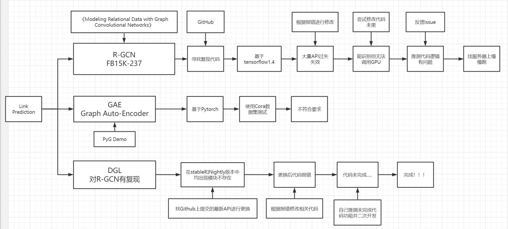

# GNN对边学习demo的探索

Link Predict（关系预测）

## 复现论文

复现论文：《[Modeling Relational Data with Graph Convolutional Networks](https://arxiv.org/abs/1703.06103)》

官方复现代码：https://github.com/MichSchli/RelationPrediction

DGL项目复现代码：https://github.com/dmlc/dgl/tree/master/examples/pytorch/rgcn


在图神经网络中，常见的模型的研究对象都是同构图（比如Cora数据集），也就是图数据中只存在一种节点和边，每个节点之间的属性格式都是相同的，这显然不符合我们的研究对象。在知识图谱中，通常包含有不同种类的节点和边，不同的节点之间拥有不同维度的特征和属性，这种图通常称为**异构图**。

针对异构图设计GNN是近几年新的研究方向。虽然论文不多，但已经在一些场景中取得了不错的效果，比如非常出名的R-GCN结构。

**Relational Graph Convolutional Network (RGCN)**

R-GCN是一个在异构图上学习节点表示的经典工作，与GCN类似，它仍然基于消息传递方法（Message Passing），但不同的是，每条边上的消息都是通过边的属性进行线性变换得到的。

使用R-GCN模型进行Link Prediction链接预测的方法有点类似于AutoEncoder。先使用R-GCN对图的每一个节点和关系学习一个高维向量表示（embedding），然后使用DistMult对学习到的高维向量表示进行解释，预测节点之间的链接。

目前更前沿的关于异构图的研究还有www2019会议上的

- Heterogeneous Graph Attention Network (HAN)，
- Knowledge Graph Convolution Networks for Recommender Systems (KGCN) 

KDD2019上的

- HetGNN: Heterogeneous Graph Neural Network、
- Metapath-guided Heterogeneous Graph Neural Network for Intent Recommendation、
- KGAT: Knowledge Graph Attention Network for Recommendation

## 探索经历



首先针对这篇论文找到了官方复现的代码，在经过一系列环境搭建，报错处理和修改之后，模型终于能够在CPU上运行。由于官方代码使用了tensorflow1.4作为backend，但tensorflow的API每个版本都在变.......最终只能搭建原版的python3.5+tensorflow1.4.1的环境。但代码在识别到GPU的情况下，仍然在用CPU进行计算，速度很慢，而且最终的结果和论文的汇报结果差距很大。

然后找到了之前使用的PyG库有对GAE（Graph Auto-Encoder）的复现代码。简单看了一下，代码使用的是Cora数据集，和我需要调研的情况有所出入，因此作为备选。

最后我找到了DGL对R-GCN的复现代码，并在此基础上做了很多尝试和修改，得到的结果和论文中汇报的结果也很接近。

## 数据集介绍

FB15k-237是FreeBase数据集的一个子集，包含237种关系和14k种实体，属于一种异构图。

|   类别   |  数量   |
| :------: | :-----: |
| Relation |   237   |
|  Entity  | 14,541  |
|  Train   | 271,115 |
|  Valid   | 17,535  |
|   Test   | 20,466  |

FreeBase是一个采用结构化数据的大型合作知识库，2014年被Google关闭，但由于其数据整体设计完善，常用来作为知识图谱方面研究的评价数据集。

#### 数据结构


- Topic：实例或实体，每一条信息叫做Topic。比如：姚明。
- Type：类型或概念，每个Topic可以属于多个Type。比如：人、运动员。
- Domain：域，对类型的分组，便于schema管理。比如：人物。
- Property：属性，每个Type可以设置一个或多个属性。比如：出生日期、所在球队。

## 官方代码复现

在本篇论文中使用FB15k-237知识库，并将关系设置为双向。

在配置好Python3.5 + tensorflow1.4.1环境后，为了加速计算过程，使用了一台装备2片RTX2080TI显卡的服务器测试。但在程序运行过程中发现，虽然tensorflow已经识别出了显卡，但计算过程中，显卡的占用率大部分时间都是0%，反而是CPU某个线程占用一直是100%，而且计算的过程很慢......

猜测占用CPU的原因应该是边数较多，导致的内存开销太大。

```shell
(tf-gnn) user-lqz@admin:~/workspace/FangHonglin/cuda_test/RelationPrediction$ bash run-train.sh /settings/gcn_block.exp
WARNING (theano.configdefaults): install mkl with `conda install mkl-service`: No module named 'mkl'
{'Decoder': {'Name': 'bilinear-diag', 'RegularizationParameter': '0.01'}, 'Encoder': {'InternalEncoderDimension': '500', 'Concatenation': 'Yes', 'StoreEdgeData': 'No', 'SkipConnections': 'None', 'Name': 'gcn_basis', 'DiagonalCoefficients': 'No', 'PartiallyRandomInput': 'No', 'UseOutputTransform': 'No', 'AddDiagonal': 'No', 'UseInputTransform': 'Yes', 'RandomInput': 'No', 'DropoutKeepProbability': '0.8', 'NumberOfLayers': '2', 'NumberOfBasisFunctions': '100'}, 'Evaluation': {'Metric': 'MRR'}, 'Shared': {'CodeDimension': '500'}, 'Optimizer': {'Algorithm': {'Name': 'Adam', 'learning_rate': '0.01'}, 'ReportTrainLossEvery': '100', 'EarlyStopping': {'CheckEvery': '2000', 'BurninPhaseDuration': '6000'}, 'MaxGradientNorm': '1'}, 'General': {'ExperimentName': 'models/GcnBlock', 'GraphSplitSize': '0.5', 'NegativeSampleRate': '10', 'GraphBatchSize': '30000'}}
272115
[<tf.Tensor 'graph_edges:0' shape=(?, 3) dtype=int32>, <tf.Tensor 'Placeholder_1:0' shape=(?, 3) dtype=int32>, <tf.Tensor 'Placeholder:0' shape=(?,) dtype=float32>]
2020-07-31 21:01:18.316900: I tensorflow/core/platform/cpu_feature_guard.cc:137] Your CPU supports instructions that this TensorFlow binary was not compiled to use: SSE4.1 SSE4.2 AVX AVX2 FMA
2020-07-31 21:01:18.558220: I tensorflow/core/common_runtime/gpu/gpu_device.cc:1030] Found device 0 with properties:
name: GeForce RTX 2080 Ti major: 7 minor: 5 memoryClockRate(GHz): 1.545
pciBusID: 0000:82:00.0
totalMemory: 10.76GiB freeMemory: 10.45GiB
2020-07-31 21:01:18.753845: I tensorflow/core/common_runtime/gpu/gpu_device.cc:1030] Found device 1 with properties:
name: GeForce RTX 2080 Ti major: 7 minor: 5 memoryClockRate(GHz): 1.545
pciBusID: 0000:83:00.0
totalMemory: 10.76GiB freeMemory: 10.45GiB
2020-07-31 21:01:18.754027: I tensorflow/core/common_runtime/gpu/gpu_device.cc:1045] Device peer to peer matrix
2020-07-31 21:01:18.754105: I tensorflow/core/common_runtime/gpu/gpu_device.cc:1051] DMA: 0 1
2020-07-31 21:01:18.754115: I tensorflow/core/common_runtime/gpu/gpu_device.cc:1061] 0:   Y N
2020-07-31 21:01:18.754122: I tensorflow/core/common_runtime/gpu/gpu_device.cc:1061] 1:   N Y
2020-07-31 21:01:18.754135: I tensorflow/core/common_runtime/gpu/gpu_device.cc:1120] Creating TensorFlow device (/device:GPU:0)-> (device: 0, name: GeForce RTX 2080 Ti, pci bus id: 0000:82:00.0, compute capability: 7.5)
2020-07-31 21:01:18.754143: I tensorflow/core/common_runtime/gpu/gpu_device.cc:1120] Creating TensorFlow device (/device:GPU:1)-> (device: 1, name: GeForce RTX 2080 Ti, pci bus id: 0000:83:00.0, compute capability: 7.5)
SampleTransformer
GradientClipping
Adam
TrainLossReporter
EarlyStopper
ModelSaver
WARNING:tensorflow:From /home/user-lqz/anaconda3/envs/tf-gnn/lib/python3.5/site-packages/tensorflow/python/util/tf_should_use.py:107: initialize_all_variables (from tensorflow.python.ops.variables) is deprecated and will be removed after 2017-03-02.
Instructions for updating:
Use `tf.global_variables_initializer` instead.
Initial loss: 1.25448
Average train loss for iteration 1-100: 0.267123520225
Average train loss for iteration 101-200: 0.148406568617
Average train loss for iteration 201-300: 0.122154484317
...
```

虽然显存容量已经达到了22G，但运行到最后还是提示`OOM`爆显存了.....

通过查阅本仓库的Issue，发现许多人在复现代码的过程中都出现了这个问题，并且也没有很好的解决方案。

根据Github [Issue#8](https://github.com/MichSchli/RelationPrediction/issues/8) **[@rayrayraykk](https://github.com/rayrayraykk)**的方法，将`gcn_block.exp`中的`GraphBatchSize`从30000改为300，`InternalEncoderDimension`和`CodeDimension`从500改为200，模型可以运行，虽然还是调用的CPU计算，但计算速度大幅增快。

```shell
{'Decoder': {'Name': 'bilinear-diag', 'RegularizationParameter': '0.01'}, 'Encoder': {'UseOutputTransform': 'No', 'DropoutKeepProbability': '0.8', 'StoreEdgeData': 'No', 'NumberOfBasisFunctions': '100', 'Name': 'gcn_basis', 'UseInputTransform': 'Yes', 'InternalEncoderDimension': '200', 'AddDiagonal': 'No', 'DiagonalCoefficients': 'No', 'Concatenation': 'Yes', 'PartiallyRandomInput': 'No', 'SkipConnections': 'None', 'NumberOfLayers': '2', 'RandomInput': 'No'}, 'General': {'GraphBatchSize': '300', 'ExperimentName': 'models/GcnBlock', 'NegativeSampleRate': '10', 'GraphSplitSize': '0.5'}, 'Evaluation': {'Metric': 'MRR'}, 'Shared': {'CodeDimension': '200'}, 'Optimizer': {'ReportTrainLossEvery': '100', 'EarlyStopping': {'BurninPhaseDuration': '6000', 'CheckEvery': '2000'}, 'MaxGradientNorm': '1', 'Algorithm': {'Name': 'Adam', 'learning_rate': '0.01'}}}
272115
[<tf.Tensor 'graph_edges:0' shape=(?, 3) dtype=int32>, <tf.Tensor 'Placeholder_1:0' shape=(?, 3) dtype=int32>, <tf.Tensor 'Placeholder:0' shape=(?,) dtype=float32>]
2020-08-01 18:32:23.568991: I tensorflow/core/platform/cpu_feature_guard.cc:137] Your CPU supports instructions that this TensorFlow binary was not compiled to use: SSE4.1 SSE4.2 AVX AVX2 FMA
2020-08-01 18:32:23.943096: I tensorflow/core/common_runtime/gpu/gpu_device.cc:1030] Found device 0 with properties: 
name: GeForce RTX 2080 Ti major: 7 minor: 5 memoryClockRate(GHz): 1.545
pciBusID: 0000:82:00.0
totalMemory: 10.76GiB freeMemory: 10.60GiB
2020-08-01 18:32:24.130528: I tensorflow/core/common_runtime/gpu/gpu_device.cc:1030] Found device 1 with properties: 
name: GeForce RTX 2080 Ti major: 7 minor: 5 memoryClockRate(GHz): 1.545
pciBusID: 0000:83:00.0
totalMemory: 10.76GiB freeMemory: 10.60GiB
2020-08-01 18:32:24.130716: I tensorflow/core/common_runtime/gpu/gpu_device.cc:1045] Device peer to peer matrix
2020-08-01 18:32:24.130816: I tensorflow/core/common_runtime/gpu/gpu_device.cc:1051] DMA: 0 1 
2020-08-01 18:32:24.130834: I tensorflow/core/common_runtime/gpu/gpu_device.cc:1061] 0:   Y N 
2020-08-01 18:32:24.130844: I tensorflow/core/common_runtime/gpu/gpu_device.cc:1061] 1:   N Y 
2020-08-01 18:32:24.130860: I tensorflow/core/common_runtime/gpu/gpu_device.cc:1120] Creating TensorFlow device (/device:GPU:0) -> (device: 0, name: GeForce RTX 2080 Ti, pci bus id: 0000:82:00.0, compute capability: 7.5)
2020-08-01 18:32:24.130876: I tensorflow/core/common_runtime/gpu/gpu_device.cc:1120] Creating TensorFlow device (/device:GPU:1) -> (device: 1, name: GeForce RTX 2080 Ti, pci bus id: 0000:83:00.0, compute capability: 7.5)
SampleTransformer
GradientClipping
Adam
TrainLossReporter
EarlyStopper
ModelSaver
WARNING:tensorflow:From /home/user-lqz/anaconda3/envs/tf-gnn/lib/python3.5/site-packages/tensorflow/python/util/tf_should_use.py:107: initialize_all_variables (from tensorflow.python.ops.variables) is deprecated and will be removed after 2017-03-02.
Instructions for updating:
Use `tf.global_variables_initializer` instead.
Initial loss: 0.733639
Average train loss for iteration 1-100: 0.398559064865
Average train loss for iteration 101-200: 0.314240244925
Average train loss for iteration 201-300: 0.283124372214
Average train loss for iteration 301-400: 0.262287636399
Average train loss for iteration 401-500: 0.244079045802
Average train loss for iteration 501-600: 0.224757089317
Average train loss for iteration 601-700: 0.217351132631
Average train loss for iteration 701-800: 0.20891327545
Average train loss for iteration 801-900: 0.197149130404
Average train loss for iteration 901-1000: 0.186215469241
Average train loss for iteration 1001-1100: 0.179507168084
Average train loss for iteration 1101-1200: 0.181720136255
Average train loss for iteration 1201-1300: 0.180589640588
Average train loss for iteration 1301-1400: 0.174662291855
Average train loss for iteration 1401-1500: 0.166378410906
Average train loss for iteration 1501-1600: 0.161896246821
Average train loss for iteration 1601-1700: 0.161435388848
Average train loss for iteration 1701-1800: 0.159836556613
Average train loss for iteration 1801-1900: 0.162233484685
	    Raw	    Filtered
MRR	    0.012	0.012
H@1	    0.003	0.003
H@3	    0.008	0.008
H@10	0.021	0.022
Tested validation score at iteration 2000. Result: 0.0115082829409
saving...
Average train loss for iteration 1901-2000: 0.151952287182
Average train loss for iteration 2001-2100: 0.152650370747
Average train loss for iteration 2101-2200: 0.149650777802
Average train loss for iteration 2201-2300: 0.149231404066
Average train loss for iteration 2301-2400: 0.150278929994
Average train loss for iteration 2401-2500: 0.151916629821
Average train loss for iteration 2501-2600: 0.143547384217
Average train loss for iteration 2601-2700: 0.143923636898
Average train loss for iteration 2701-2800: 0.141646012366
Average train loss for iteration 2801-2900: 0.141806647405
Average train loss for iteration 2901-3000: 0.142812938094
Average train loss for iteration 3001-3100: 0.140599277988
Average train loss for iteration 3101-3200: 0.13751272589
Average train loss for iteration 3201-3300: 0.139074690044
Average train loss for iteration 3301-3400: 0.137135729194
Average train loss for iteration 3401-3500: 0.136827448159
Average train loss for iteration 3501-3600: 0.1353039518
Average train loss for iteration 3601-3700: 0.13576267533
Average train loss for iteration 3701-3800: 0.138574075177
Average train loss for iteration 3801-3900: 0.135007323623
	    Raw	    Filtered
MRR	    0.017	0.018
H@1	    0.006	0.006
H@3	    0.013	0.014
H@10	0.031	0.033
Tested validation score at iteration 4000. Result: 0.0173423935426
saving...
Average train loss for iteration 3901-4000: 0.135105981305
Average train loss for iteration 4001-4100: 0.136301774904
Average train loss for iteration 4101-4200: 0.133662451655
Average train loss for iteration 4201-4300: 0.135636581704
Average train loss for iteration 4301-4400: 0.132769066095
Average train loss for iteration 4401-4500: 0.133558651209
Average train loss for iteration 4501-4600: 0.133253392652
Average train loss for iteration 4601-4700: 0.134220164716
Average train loss for iteration 4701-4800: 0.132240785509
Average train loss for iteration 4801-4900: 0.132114236206
Average train loss for iteration 4901-5000: 0.130822513774
Average train loss for iteration 5001-5100: 0.130252244174
Average train loss for iteration 5101-5200: 0.130456224829
Average train loss for iteration 5201-5300: 0.132644971162
Average train loss for iteration 5301-5400: 0.128310849592
Average train loss for iteration 5401-5500: 0.129062893018
Average train loss for iteration 5501-5600: 0.131218217239
Average train loss for iteration 5601-5700: 0.128327239677
Average train loss for iteration 5701-5800: 0.128901169524
Average train loss for iteration 5801-5900: 0.127758514881
		Raw		Filtered
MRR		0.02	0.02
H@1		0.007	0.007
H@3		0.016	0.016
H@10	0.038	0.04
Tested validation score at iteration 6000. Result: 0.019700886744
saving...
Average train loss for iteration 5901-6000: 0.128414031491
Average train loss for iteration 6001-6100: 0.128678858802
Average train loss for iteration 6101-6200: 0.129787306339
Average train loss for iteration 6201-6300: 0.130661423728
Average train loss for iteration 6301-6400: 0.125296980664
Average train loss for iteration 6401-6500: 0.126010311395
Average train loss for iteration 6501-6600: 0.127962349132
Average train loss for iteration 6601-6700: 0.127901101038
Average train loss for iteration 6701-6800: 0.125632699803
Average train loss for iteration 6801-6900: 0.125565705001
Average train loss for iteration 6901-7000: 0.126050799638
Average train loss for iteration 7001-7100: 0.123286731467
Average train loss for iteration 7101-7200: 0.129371566772
Average train loss for iteration 7201-7300: 0.13400388822
Average train loss for iteration 7301-7400: 0.127659037486
Average train loss for iteration 7401-7500: 0.125996452421
Average train loss for iteration 7501-7600: 0.12586839363
Average train loss for iteration 7601-7700: 0.124882008061
Average train loss for iteration 7701-7800: 0.124159323312
Average train loss for iteration 7801-7900: 0.124195801616
		Raw		Filtered
MRR		0.022	0.023
H@1		0.008	0.008
H@3		0.019	0.019
H@10	0.042	0.044
Tested validation score at iteration 8000. Result: 0.022275383556
saving...
Average train loss for iteration 7901-8000: 0.127038534582
Average train loss for iteration 8001-8100: 0.124251663908
Average train loss for iteration 8101-8200: 0.124876790196
Average train loss for iteration 8201-8300: 0.12558349967
Average train loss for iteration 8301-8400: 0.124531253949
Average train loss for iteration 8401-8500: 0.125098097101
Average train loss for iteration 8501-8600: 0.124462078065
Average train loss for iteration 8601-8700: 0.1262208803
Average train loss for iteration 8701-8800: 0.126135697663
Average train loss for iteration 8801-8900: 0.125756008253
Average train loss for iteration 8901-9000: 0.125989745408
Average train loss for iteration 9001-9100: 0.125483163223
Average train loss for iteration 9101-9200: 0.124200710543
Average train loss for iteration 9201-9300: 0.122691995502
Average train loss for iteration 9301-9400: 0.122893726453
Average train loss for iteration 9401-9500: 0.125107270852
Average train loss for iteration 9501-9600: 0.126149047986
Average train loss for iteration 9601-9700: 0.124828136191
Average train loss for iteration 9701-9800: 0.123932513446
Average train loss for iteration 9801-9900: 0.123825722784
		Raw		Filtered
MRR		0.029	0.032
H@1		0.012	0.012
H@3		0.025	0.028
H@10	0.055	0.059
Tested validation score at iteration 10000. Result: 0.032109358205
saving...
Average train loss for iteration 9901-10000: 0.122377600595
Average train loss for iteration 10001-10100: 0.122479913607
Average train loss for iteration 10101-10200: 0.126490946785
Average train loss for iteration 10201-10300: 0.131784814745
Average train loss for iteration 10301-10400: 0.124623856246
Average train loss for iteration 10401-10500: 0.126125487313
Average train loss for iteration 10501-10600: 0.124828394502
Average train loss for iteration 10601-10700: 0.124754978046
Average train loss for iteration 10701-10800: 0.126575767472
Average train loss for iteration 10801-10900: 0.124978147447
Average train loss for iteration 10901-11000: 0.124048930407
Average train loss for iteration 11001-11100: 0.125314957276
Average train loss for iteration 11101-11200: 0.12510120675
Average train loss for iteration 11201-11300: 0.123760017082
Average train loss for iteration 11301-11400: 0.129462359548
Average train loss for iteration 11401-11500: 0.125138808787
Average train loss for iteration 11501-11600: 0.121126376614
Average train loss for iteration 11601-11700: 0.125720160753
Average train loss for iteration 11701-11800: 0.124498691037
Average train loss for iteration 11801-11900: 0.124156257957
		Raw		Filtered
MRR		0.027	0.029
H@1		0.009	0.01
H@3		0.025	0.027
H@10	0.056	0.059
Tested validation score at iteration 12000. Result: 0.0279832806244
Stopping criterion reached.
Stopping training.
```

改动之后代码可以跑通，但MRR值远低于论文中汇报的0.158，效果不是很好。

## DGL复现

DGL在2019年上线了最新的0.4版本，增加了对异构图的支持，并且复现开源了一些图神经网络的代码，其中就包括R-GCN，并且在R-GCN上使用了全新的异构图接口，减少了内存开销并可以调用多个GPU加速计算。

**ToDo**：DGL也提供了知识图谱嵌入（Knowledge Graph Embedding）专用包DGL-KE，支持多GPU并行计算并实现了许多经典的图嵌入模型。

我使用的是目前最新的 `DGL0.4.2post3` 版本

在使用DGL开源的复现代码时，经常会出现`No Module named xxx`的情况，可以通过从Github上拖取最新的代码解决。我拖取的文件列表如下

- `dgl/data`
  - `dgl_dataset.py`
  - `knowledge_graph.py`
  - `tensor_serialize.py`

- `dgl/utils/*`

但是替换之后，仍然有一个错误存在，信息如下：

```shell
Traceback (most recent call last):
  File "link_predict.py", line 259, in <module>
    main(args)
  File "link_predict.py", line 89, in main
    data = load_data(args.dataset)
  File "D:\Anaconda3\envs\gnn\lib\site-packages\dgl\data\knowledge_graph.py", line 721, in load_data
    return FB15k237Dataset()
  File "D:\Anaconda3\envs\gnn\lib\site-packages\dgl\data\knowledge_graph.py", line 428, in __init__
    super(FB15k237Dataset, self).__init__(name, reverse, raw_dir, force_reload, verbose)
  File "D:\Anaconda3\envs\gnn\lib\site-packages\dgl\data\knowledge_graph.py", line 48, in __init__
    verbose=verbose)
  File "D:\Anaconda3\envs\gnn\lib\site-packages\dgl\data\dgl_dataset.py", line 263, in __init__
    verbose=verbose)
  File "D:\Anaconda3\envs\gnn\lib\site-packages\dgl\data\dgl_dataset.py", line 71, in __init__
    self._load()
  File "D:\Anaconda3\envs\gnn\lib\site-packages\dgl\data\dgl_dataset.py", line 155, in _load
    self.process()
  File "D:\Anaconda3\envs\gnn\lib\site-packages\dgl\data\knowledge_graph.py", line 90, in process
    g, data = build_knowledge_graph(num_nodes, num_rels, train, valid, test, reverse=self.reverse)
  File "D:\Anaconda3\envs\gnn\lib\site-packages\dgl\data\knowledge_graph.py", line 321, in build_knowledge_graph
    g = dgl_graph((s, d), num_nodes=num_nodes)
  File "D:\Anaconda3\envs\gnn\lib\site-packages\dgl\convert.py", line 137, in graph
    restrict_format=restrict_format)
  File "D:\Anaconda3\envs\gnn\lib\site-packages\dgl\convert.py", line 811, in create_from_edges
    num_ntypes, urange, vrange, u, v, restrict_format)
  File "D:\Anaconda3\envs\gnn\lib\site-packages\dgl\heterograph_index.py", line 982, in create_unitgraph_from_coo
    F.to_dgl_nd(row), F.to_dgl_nd(col),
  File "D:\Anaconda3\envs\gnn\lib\site-packages\dgl\backend\__init__.py", line 94, in to_dgl_nd
    return zerocopy_to_dgl_ndarray(data)
  File "D:\Anaconda3\envs\gnn\lib\site-packages\dgl\backend\pytorch\tensor.py", line 283, in zerocopy_to_dgl_ndarray
    return nd.from_dlpack(dlpack.to_dlpack(input.contiguous()))
AttributeError: 'Index' object has no attribute 'contiguous'
```

于是我从原始文件开始，沿着错误路径一步一步查阅源码，并试图理解相关代码的意思。

最终发现在DGL的相关文件中，缺少了一些方法，需要手动添加代码......

### 对DGL的简单二次开发

错误出在加载原始数据的load_data方法，错误引用路径如下：

`link_predict -> dgl/data/knowledge_graph -> dgl/data/dgl_dataset -> dgl/data/knowledge_graph -> dgl/convert -> dgl/heterograph_index -> dgl/backend/__init__ -> dgl/backend/pytorch/tensor`

最终的报错显示是因为`input`对象不存在`contiguous`方法。

在经过一天的时间阅读相关代码后，发现`input`的类型是`dgl/utils.Index`，找到`dgl/utils/internal.py`文件，确实缺少`contiguous`方法。Github最新的代码中也没有......

最终决定自己实现这个方法。

首先需要弄清楚缺失函数的作用。

通过引用发现dlpack是Pytorch.util的一个对象，通过查阅资料得知，`to_dlpack(Tensor)`的传入参数应该为一个Tensor张量。再结合前几天阅读代码得到input的类型，这样就明白缺失的`contiguous()`作用是将`utils.Index`转化为`Tensor`张量。

接下来就是编写代码：

```python
import torch
def contiguous(self):
    if self._pydata is None:
        self._pydata = self.tonumpy()
    return torch.from_numpy(self._pydata)
```

添加之后，这项错误就通过了。然而在`knowledge_graph`的`build_knowledge_graph`方法中

```python
g = dgl_graph((s, d), num_nodes=num_nodes)
```

创建图的方法一直在报错，看信息应该是底层c和h库的问题，修改起来太麻烦，于是决定通过更换构建图的方式来规避这项错误。将这行代码替换为如下：

```python
g = dgl.DGLGraph()
g.add_nodes(num_nodes)
g.add_edges(s, d)
```

在`rgcn/utils`中同样，`g = dgl.graph([])`方法创建空图会报底层错误，更换为另一种构建方法`g = dgl.DGLGraph()`

最终成功让模型跑起来，但因为我笔记本显存只有2G，不出意外直接爆显存了。将改动代码和dgl库迁移到深度学习服务器中，用2080Ti跑，结果如下：

```shell
(pytorch) user-lqz@admin:~/workspace/FangHonglin/cuda_test/rgcn$ python link_predict.py -d FB15k-237 --gpu 0 --eval-protocol raw
Using backend: pytorch
Namespace(dataset='FB15k-237', dropout=0.2, edge_sampler='uniform', eval_batch_size=500, eval_protocol='raw', evaluate_every=500, gpu=0, grad_norm=1.0, graph_batch_size=30000, graph_split_size=0.5, lr=0.01, n_bases=100, n_epochs=6000, n_hidden=500, n_layers=2, negative_sample=10, regularization=0.01)
# entities: 14541
# relations: 237
# training edges: 272115
# validation edges: 17535
# testing edges: 20466
num_nodes: 14541, s_shape: (620232,), d_shape: (620232,)
Done saving data into cached files.
/home/user-lqz/anaconda3/envs/pytorch/lib/python3.7/site-packages/dgl/data/utils.py:285: UserWarning: Property dataset.train will be deprecated, please use g.edata['train_mask'] instead.
  warnings.warn('Property {} will be deprecated, please use {} instead.'.format(old, new))
/home/user-lqz/anaconda3/envs/pytorch/lib/python3.7/site-packages/dgl/data/utils.py:285: UserWarning: Property dataset.valid will be deprecated, please use g.edata['val_mask'] instead.
  warnings.warn('Property {} will be deprecated, please use {} instead.'.format(old, new))
/home/user-lqz/anaconda3/envs/pytorch/lib/python3.7/site-packages/dgl/data/utils.py:285: UserWarning: Property dataset.test will be deprecated, please use g.edata['test_mask'] instead.
  warnings.warn('Property {} will be deprecated, please use {} instead.'.format(old, new))
Test graph:
/home/user-lqz/workspace/FangHonglin/cuda_test/rgcn/utils.py:128: RuntimeWarning: divide by zero encountered in true_divide
  norm = 1.0 / in_deg
# nodes: 14541, # edges: 544230
start training...
# sampled nodes: 11778
# sampled edges: 30000
# nodes: 11778, # edges: 30000
Done edge sampling
Epoch 0001 | Loss 2.4259 | Best MRR 0.0000 | Forward 1.6422s | Backward 0.4032s
# sampled nodes: 11797
# sampled edges: 30000
# nodes: 11797, # edges: 30000
Done edge sampling
Epoch 0002 | Loss 3.3204 | Best MRR 0.0000 | Forward 0.0373s | Backward 0.0769s
# sampled nodes: 11738
# sampled edges: 30000
# nodes: 11738, # edges: 30000
Done edge sampling
Epoch 0003 | Loss 17.1309 | Best MRR 0.0000 | Forward 0.0375s | Backward 0.0769s
# sampled nodes: 11790
# sampled edges: 30000
# nodes: 11790, # edges: 30000
Done edge sampling
```

可以发现，模型的`Best MRR`一直为0，模型并没有进行学习。推测可能和`RuntimeWarning: divide by zero encountered in true_divide`有关

出错代码为：

```python
def comp_deg_norm(g):
    g = g.local_var()
    in_deg = g.in_degrees(range(g.number_of_nodes())).float().numpy()
    norm = 1.0 / in_deg
    norm[np.isinf(norm)] = 0
    return norm
```

其中`g`为Graph，`in_degrees()`通过自己编写一个demo测试后得知是计算每个节点的入度，当节点入度为0，自然在norm计算时会报错，返回inf。但后面也将inf值修正为了0，因此这里报错是正常现象，MRR为0的原因还要找找。

后来仔细查看代码后才发现，这里的MRR是best MRR的意思，代码中设置的是每500个epoch评估一次MRR，原因是评估MRR值是在CPU上进行的，如果每个epoch都进行评估，则需要很大的时间代价，因此每500次epoch进行一次评估。因此在前500个epoch里面，MRR显示的就是0。只需要多运行一会儿就好。

最终结果如下：

```shell
...
Epoch 0999 | Loss 0.0860 | Best MRR 0.1392 | Forward 0.0540s | Backward 0.1129s
# sampled nodes: 11762
# sampled edges: 30000
# nodes: 11762, # edges: 30000
Done edge sampling
Epoch 1000 | Loss 0.0874 | Best MRR 0.1392 | Forward 0.0556s | Backward 0.1079s
start eval
batch 0 / 41
batch 1 / 41
batch 2 / 41
batch 3 / 41
...
Done edge sampling
Epoch 6500 | Loss 0.0754 | Best MRR 0.1506 | Forward 0.0373s | Backward 0.0771s
start eval
batch 0 / 41
...
batch 40 / 41
MRR (raw): 0.147854
Hits (raw) @ 1: 0.078740
Hits (raw) @ 3: 0.158385
Hits (raw) @ 10: 0.281320
training done
Mean forward time: 0.051310s
Mean Backward time: 0.100028s
start testing:
Using best epoch: 6000
MRR (raw): 0.150629
Hits (raw) @ 1: 0.085288
Hits (raw) @ 3: 0.156259
Hits (raw) @ 10: 0.280294
```

